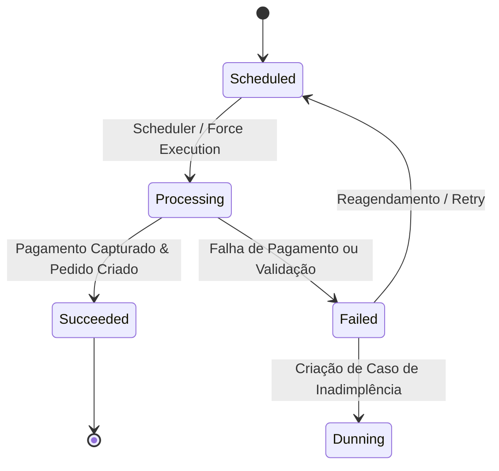

# Arquitetura de Renovações (Renewals)

Este documento descreve a arquitetura atual da área de `Renovações` (`Renewals`) no plugin `Reorder`.

O foco está no sistema implementado em produção, e não nas premissas iniciais de design.

## Objetivo

A área de `Renovações` fornece a camada de execução e revisão operacional para cobranças recorrentes de assinaturas.

A implementação atual suporta:
- Rastreamento de ciclos de renovação (`renewal_cycle`) e histórico de tentativas (`renewal_attempt`)
- Processamento automatizado agendado via tarefa periódica do Medusa (`Medusa Job`)
- Forçar execução manual a partir do Admin (`force-renewal`)
- Aprovação e rejeição de alterações de assinatura pendentes antes da renovação
- Painel de fila de espera (`queue`) e visualização detalhada de renovações no Admin
- Integração profunda com `Subscriptions` e `Plans & Offers`
- Integração com `Dunning` para falhas de renovação qualificadas por motivo de pagamento
- Endurecimento operacional através de bloqueio de concorrência (`workflow locking`), IDs de correlação, logs estruturados e métricas de execução do scheduler

## Visão Geral da Arquitetura

A implementação está dividida em quatro camadas principais:

1. **Módulo de Domínio (`domain module`)**
2. **Workflows e Job Agendado (`workflows and scheduled job`)**
3. **API Admin (`admin API`)**
4. **Interface do Admin (`admin UI`)**

Cada camada possui responsabilidade estrita:

- O **módulo de domínio** é proprietário dos modelos `renewal_cycle` e `renewal_attempt`.
- Os **workflows** gerenciam a execução, aprovação, rejeição e mutações de execução forçada.
- O **job agendado** localiza ciclos vencidos e aciona o workflow de execução compartilhado.
- A **API Admin** expõe rotas de consulta e mutação para os operadores.
- A **UI do Admin** renderiza as visões de fila e detalhes consumindo a API Admin.

---

## 1. Módulo de Domínio

O módulo customizado `renewal` é o proprietário do domínio de execução recorrente.

Ele contém:
- Tipos de domínio estritos (`types/index.ts`)
- Modelo de dados `RenewalCycle` (`models/renewal-cycle.ts`)
- Modelo de dados `RenewalAttempt` (`models/renewal-attempt.ts`)
- Serviço do módulo (`service.ts`)
- Utilitários de leitura para a fila, detalhes e consultas do scheduler (`utils/`)

### Decisões Principais de Design:
- Um ciclo de renovação representa uma unidade concreta de faturamento vencida para uma assinatura.
- O histórico de tentativas de cobrança é armazenado separadamente do agregado principal do ciclo.
- A assinatura (`Subscription`) permanece como a fonte de verdade do estado ativo do cliente, enquanto o ciclo (`RenewalCycle`) é a fonte do histórico de execução e faturamento.

---

## 2. Modelo de Dados

O modelo `renewal_cycle` armazena:
- `id`: Identificador único do ciclo (ex: `rc_01...`)
- `subscription_id`: ID da assinatura associada
- `scheduled_for`: Data/hora programada para o processamento
- `processed_at`: Data/hora em que o processamento foi concluído
- `status`: Estado atual (`scheduled`, `processing`, `succeeded`, `failed`)
- `approval_required`: Flag indicando se requer aprovação humana prévia
- `approval_status`: Estado da aprovação (`pending`, `approved`, `rejected`)
- `approval_decided_at`: Data da decisão de aprovação
- `approval_decided_by`: Operador ou sistema que tomou a decisão
- `approval_reason`: Motivo da aprovação ou rejeição
- `generated_order_id`: ID do pedido Medusa gerado pelo ciclo
- `applied_pending_update_data`: Snapshot das alterações de plano aplicadas neste ciclo
- `last_error`: Mensagem descritiva do último erro ocorrido
- `attempt_count`: Quantidade de tentativas de execução realizadas
- `metadata`: Metadados operacionais

O modelo `renewal_attempt` armazena:
- `id`: Identificador da tentativa
- `renewal_cycle_id`: ID do ciclo pai
- `attempt_no`: Número sequencial da tentativa (1, 2, 3...)
- `started_at` e `finished_at`: Timestamps de início e fim da execução
- `status`: Resultado (`processing`, `succeeded`, `failed`)
- `error_code` e `error_message`: Diagnóstico detalhado de falhas
- `payment_reference`: Identificador da transação no gateway
- `order_id`: Pedido resultante gerado

---

## 3. Máquina de Estados e Ciclo de Vida

### Estados do Ciclo de Renovação:
1. **`scheduled`**: Ciclo agendado aguardando data de vencimento (`scheduled_for`).
2. **`processing`**: Em execução ativa com lock distribuído adquirido.
3. **`succeeded`**: Pagamento processado, pedido Medusa criado e próximo ciclo agendado na assinatura.
4. **`failed`**: Falha na autorização de pagamento, estoque ou validação de regras.

---

## 4. Integração com Dunning (Cobrança e Recuperação)

Quando uma tentativa de renovação falha por motivo qualificado de pagamento (ex: cartão recusado, saldo insuficiente, token expirado):
- O ciclo é marcado como `failed`.
- Um **caso de dunning** (`DunningCase`) é criado automaticamente associando a assinatura e o ciclo com falha.
- A assinatura transiciona para o status `past_due`.
- O motor de Dunning assume o controle de novas tentativas com base no cronograma configurado.

---

## 5. Endurecimento Operacional e Concorrência

Para garantir estabilidade em escala e evitar cobranças duplicadas:
- **Bloqueio Distribuído (`Distributed Locks`)**: Cada ciclo adquire um lock exclusivo com chave baseada no `renewal_cycle_id` e `subscription_id` antes da cobrança.
- **IDs de Correlação (`Correlation IDs`)**: Rastreabilidade ponta a ponta desde o scheduler até o webhook de pagamento.
- **Logs Estruturados**: Emissão de métricas operacionais com contagem de processados, sucessos, falhas e latência em milissegundos.
